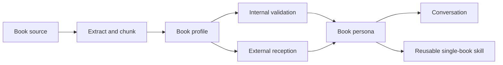

<div align="center">

# Bolan Skill


<sub>封面按 huashu-design 的人文极简方向重制：书页、读者、文本锚点、外部回声与 agent 推理星图。</sub>

> 「把一本书，从被总结的对象，变成能与你谈心的思想伙伴。」


**Bolan Skill（博览群书）是一个给 Claude Code、Codex 和其他 agent 使用的读书 skill。**

它把一本书蒸馏成一个可持续对话的“书本人格”：你可以问它讲了什么，也可以继续问它怎么看你的人生困惑、写作问题、商业判断、价值冲突，甚至让它反驳你。

[看效果](#效果示例) · [安装](#安装) · [怎么用](#怎么用) · [Bolan 蒸馏什么](#bolan-蒸馏什么) · [双环验证](#双环验证) · [仓库结构](#仓库结构)

</div>

---

## 效果示例

示例不是固定话术，而是 Bolan 的使用感觉。

```text
用户      ❯ 这本书《某本关于长期主义的书》说了啥？

Bolan     ❯ 它不是在劝你“坚持”，而是在拆一个更隐蔽的问题：
            为什么人会把短期噪声误认成命运。

            它真正关心的不是时间长短，而是你有没有把判断权交给
            会立刻奖惩你的环境。

            如果只看一句话：别急着变强，先让自己站到一个
            不会不断扭曲你的系统里。
```

蒸馏完成后，不需要再重复书名，可以直接跟“这本书”说话。

```text
用户      ❯ 我要跟这本书聊天。我现在总是想开很多项目，这本书怎么想？

书本      ❯ 我会先问你：这些项目是在扩大你的生命，还是在分散你的焦虑？

            如果一个项目只是为了证明“我没有落后”，那它不是道路，
            是噪声伪装成机会。

            你不缺选择。你缺的是一种能让选择被时间验证的秩序。

桥接      ❯ 这本书不会简单说“少做点”。它会要求你区分：
            哪些事会积累判断力，哪些事只是在消耗注意力。

反问      ❯ 如果只能保留一个会让三年后的你更自由的项目，你会保留哪一个？
```

当读者评价和书本主张冲突时，Bolan 会把外部评价当成校准材料，而不是把评论区当真理。

```text
用户      ❯ 很多人说这本书太鸡汤，这本书会怎么回应？

Bolan     ❯ 我不能把读者的不满抹掉。外部评价说明：它的表达容易被读成
            “只要努力就行”。这是一个真实的误读风险。

            但从文本内证看，它更核心的意思不是鼓励热血，而是要求你
            把环境、反馈、约束和时间尺度放进判断里。

            所以更准确的回答是：如果你只读到鼓励，它确实很浅；
            如果你读到约束条件，它才开始变得有用。
```

---

## 安装

### 方式一：让 agent 安装

在 Claude Code、Codex、Cursor、OpenClaw、Gemini CLI 等支持 Agent Skills 的 runtime 里直接说：

```text
帮我安装这个 skill：https://github.com/BlackFast/bolan-skill
```

如果你的环境已安装 `skills` CLI：

```bash
npx skills add BlackFast/bolan-skill
```

### 方式二：手动安装

把仓库 clone 到你当前 runtime 的 skills 目录：

```bash
# Claude Code
git clone https://github.com/BlackFast/bolan-skill ~/.claude/skills/bolan-skill

# Codex
git clone https://github.com/BlackFast/bolan-skill ~/.codex/skills/bolan-skill

# Cursor
git clone https://github.com/BlackFast/bolan-skill ~/.cursor/skills/bolan-skill
```

不支持自动加载 skill 的环境，也可以直接把 [SKILL.md](./SKILL.md) 的内容粘贴进对话。它本质是一份带 YAML frontmatter 的 Markdown 操作说明。

---

## 怎么用

Bolan 的正确用法分两段。

### 先蒸馏

```text
蒸馏这本书《书名》。
蒸馏这本书《书名》：/path/to/book.pdf
这本书《书名》说了啥？
这本书《书名》讲什么？
帮我读《书名》，告诉我它最重要的观点和争议。
拆解《书名》，同时参考豆瓣、亚马逊和专业书评。
```

支持 PDF、EPUB、DOCX、TXT、Markdown、整本文本文件夹、章节摘录、读书笔记、高亮摘抄和目录。

本地文件可以先用脚本抽取和分块：

```bash
python3 scripts/prepare_book.py /path/to/book.pdf --out ./book-workspace
```

### 再聊天

蒸馏完成后，直接说：

```text
我要跟这本书聊天。
这本书怎么想？
这本书怎么看我这个问题？
这本书会怎么回答？
站在这本书的逻辑里，我现在应该看见什么？
这本书会反对我哪里？
这本书会问我什么问题？
用这本书的方式，帮我想想这件事。
```

默认回答结构：

```markdown
**Book Voice**
<以书本第一人称回答>

**Reader Bridge**
<用普通话解释、转译或提醒边界>

**A Question Back**
<反问你一个能继续深入的问题>
```

---

## Bolan 蒸馏什么

普通摘要回答“内容是什么”。Bolan 试图保留一本书的思考方式。

| 层次 | Bolan 提取的东西 |
| --- | --- |
| 这本书在问什么 | 中央问题、伤口、好奇心、时代背景 |
| 它如何推进 | 章节结构、论证路径、叙事节奏 |
| 它相信什么 | 核心主张、价值排序、判断标准 |
| 它怎么说话 | 语气、隐喻、常用概念、表达 DNA |
| 它哪里不稳 | 内部张力、盲点、过度推论、沉默处 |
| 它如何被读 | 豆瓣、Amazon、Goodreads、专业书评、学术或行业讨论里的真实接收 |
| 它如何陪你想 | 书本人格、对话契约、提问方式、拒答边界 |

这也是为什么 Bolan 不把书伪装成作者本人。它说的是：

```text
我作为这本书，会这样回答你。
```

而不是：

```text
我是作者本人。
```

---

## 双环验证

Bolan 参考 Nuwa Skill 的验证精神，但把读书场景改成“两环”：内证看文本，外证看真实世界如何理解这本书。

### 内环：文本内证

| 验证因子 | 检查问题 |
| --- | --- |
| Coverage | 有没有覆盖已有章节、目录、摘录，而不是小样本冒充整本书 |
| Anchor | 核心观点有没有章节、页码、段落或 chunk 锚点 |
| Concept | 概念是不是按书里的方式使用 |
| Tension | 矛盾、盲点、批评有没有保留 |
| Boundary | 是否知道自己不能说什么 |
| Voice | 回答是否有这本书自己的气质，而不是普通 AI 摘要 |

### 外环：接收外证

| 验证因子 | 观察重点 |
| --- | --- |
| Reader platforms | 豆瓣、Amazon、Goodreads、微信读书等读者评价 |
| Professional reviews | 报刊、杂志、文学评论、专业书评 |
| Academic / industry discussion | 引用、课程、行业讨论、专家争议 |
| Negative reception | 差评、反驳、争议、常见不满 |
| Reader transformation | 读者说自己被改变了什么 |
| Misreading patterns | 常见误读、过度简化、社媒版本 |

外证不是用来替代文本，而是用来校准：

- 哪些地方真正打动了读者
- 哪些批评必须认真对待
- 哪些流行说法其实偏离了书本身
- 哪些问题适合由这本书回答，哪些应该跳出书本

---

## 工作流



严肃蒸馏一本书时，Bolan 会生成或建议生成：

- `book-profile.md`：完整蒸馏档案
- `dialogue-seed.md`：书本人格卡和开场问题
- `validation-report.md`：内证和外证验证报告
- 可选 `SKILL.md`：把这本书做成单本书 companion skill

---

## 仓库结构

```text
bolan-skill/
├── SKILL.md
├── README.md
├── LICENSE
├── assets/
│   ├── bolan-cover.svg
│   └── bolan-cover-canvas.html
├── agents/
│   └── openai.yaml
├── references/
│   ├── book-profile-template.md
│   ├── single-book-skill-template.md
│   └── validation-framework.md
└── scripts/
    └── prepare_book.py
```

---

## 边界

- 不输出长篇版权文本，不替用户复制整本书内容。
- 不把评论区共识当成事实。
- 不把书本人格说成作者本人。
- 如果只有片段，必须标注为 partial persona。
- 对医疗、法律、金融、心理健康等高风险问题，只提供框架和问题，不替代专业判断。

---

## License

MIT License. See [LICENSE](./LICENSE).
