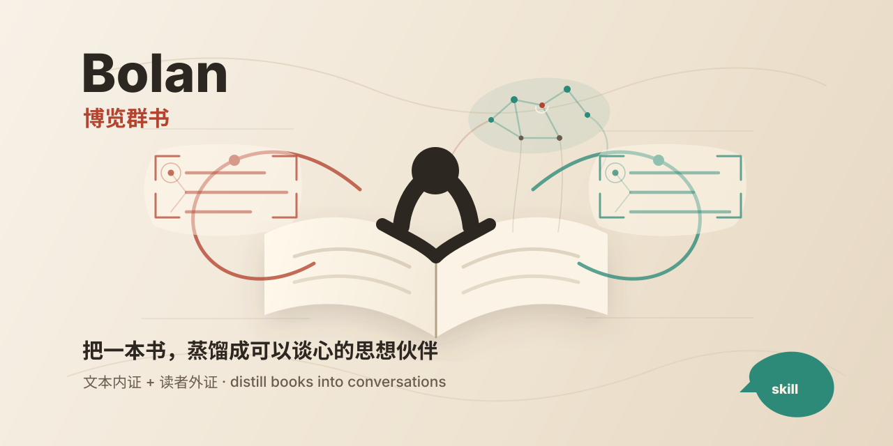
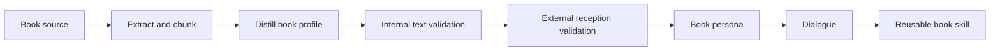

# Bolan · 博览群书

<p align="center">
  
</p>

**Bolan** 是一个给 Claude Code、Codex 和其他 agent 使用的读书 skill。它把一本书蒸馏成一个可以对话的“书本人格”：你不只是问“这本书讲了什么”，而是可以继续问它、反驳它、向它求解、让它陪你把一个问题想深。

它的核心目标是：

> 把书从“被总结的对象”，变成“能与你持续对话的思想伙伴”。

## 适合什么时候用

- 你想知道：**这本书《》说了啥？**
- 你想精读：**蒸馏这本书《》**
- 你想聊天：**我要跟这本书《》聊天**
- 你想拆解一本书的思想结构、概念、争议、盲点和真实读者反馈
- 你想把一本书做成长期可复用的单本书 companion skill
- 你不满足于普通摘要，希望保留一本书的语气、问题意识、价值排序和局限

## 快速用法

不用记 skill 名，也不用写 `$bolan`。Bolan 的正确使用方式分两段。

第一段：先把书蒸馏出来。

```text
蒸馏这本书《书名》。
蒸馏这本书《书名》：/path/to/book.pdf
这本书《书名》说了啥？
这本书《书名》讲什么？
帮我读《书名》，告诉我它最重要的观点和争议。
拆解《书名》，同时参考豆瓣、亚马逊和专业书评。
```

第二段：蒸馏完成后，直接跟“这本书”聊天。

```text
我要跟这本书聊天。
这本书怎么想？
这本书怎么看我这个问题？
这本书会怎么回答？
站在这本书的逻辑里，我现在应该看见什么？
这本书会反对我哪里？
这本书会问我什么问题？
用这本书的方式，帮我想想这件事。
```

`$bolan` 仍然可以显式调用：

```text
Use $bolan to turn this book into a conversational persona.
```

## 三种入口

### 1. “这本书《》说了啥？”

适合快速了解一本书。

输出重点：

- 这本书试图回答什么问题
- 它的核心观点是什么
- 它适合谁读
- 它哪里有争议
- 如果没有全文，明确标注低置信度

### 2. “蒸馏这本书《》”

适合严肃精读和长期保存。

输出重点：

- `book-profile.md`：完整蒸馏档案
- `dialogue-seed.md`：书本人格卡和开场问题
- `validation-report.md`：内证和外证验证报告
- 可选 `SKILL.md`：把这本书做成单本书 skill

### 3. “我要跟这本书聊天 / 这本书怎么想”

适合蒸馏完成后的日常使用。

如果已有 profile，Bolan 直接使用当前书本人格回答；如果没有，先询问是哪本书或要求提供来源。

默认回答结构：

```markdown
**Book Voice**
<以书本第一人称回答>

**Reader Bridge**
<用普通话解释、转译或提醒边界>

**A Question Back**
<反问你一个能继续深入的问题>
```

## 支持的输入

本地文件：

- PDF
- EPUB
- DOCX
- TXT
- Markdown
- 一整个文本文件夹

文本材料：

- 章节摘录
- 读书笔记
- 高亮摘抄
- 目录
- 用户自己的问题清单

如果只有书名，没有全文，Bolan 会说明无法做完整文本验证。需要外部评价时，agent 应检索当前公开来源，并记录检索日期。

## 工作流



本地文件抽取脚本：

```bash
python3 bolan/scripts/prepare_book.py /path/to/book.pdf --out ./book-workspace
```

输出会包含：

- `text/book.txt`
- `chunks/chunk-*.md`
- `manifest.json`

## 验证体系：内证 + 外证

Bolan 不把“像一本书”理解成“说话有点像”。它要求两层验证。

### 内证：是否忠实于文本

| 维度 | 检查问题 |
| --- | --- |
| Coverage | 有没有覆盖已有章节、目录、摘录，而不是小样本冒充整本书 |
| Anchor | 核心观点有没有文本锚点 |
| Concept | 概念是不是按书里的方式使用 |
| Tension | 矛盾、盲点、批评有没有保留 |
| Boundary | 是否知道自己不能说什么 |
| Voice | 回答是否有这本书自己的气质 |

### 外证：真实世界如何理解这本书

| 来源 | 观察重点 |
| --- | --- |
| Reader platforms | 豆瓣、Amazon、Goodreads、微信读书等读者评价 |
| Professional reviews | 报刊、杂志、文学评论、专业书评 |
| Academic / industry discussion | 引用、课程、行业讨论、专家争议 |
| Negative reception | 差评、反驳、争议、常见不满 |
| Reader transformation | 读者说自己被改变了什么 |
| Misreading patterns | 常见误读、过度简化、社媒版本 |

外部评价不是用来替代文本，而是用来校准：

- 读者到底从这本书里读出了什么
- 哪些地方最容易被误读
- 哪些批评必须被认真对待
- 哪些流行说法其实偏离了书本身

## 书本人格，不是作者模仿

Bolan 说话时扮演的是“这本书”，不是作者本人。

它可以说：

```text
我作为这本书，会这样回答你。
```

它不应该说：

```text
我是作者本人。
```

这个边界很重要。Bolan 的目标是保留书的思想结构，而不是伪造作者人格。

## 安装

仓库里真正的 skill 目录是：

```text
bolan/
```

Codex 可放到：

```text
~/.codex/skills/bolan
```

Claude / agents 体系可放到：

```text
~/.agents/skills/bolan
```

也可以在项目中保留 `bolan/` 目录，让 agent 明确读取该 skill。

## 目录结构

```text
bolan-github/
├── README.md
├── assets/
│   ├── bolan-cover.svg
│   └── bolan-cover-canvas.html
└── bolan/
    ├── SKILL.md
    ├── agents/
    │   └── openai.yaml
    ├── references/
    │   ├── book-profile-template.md
    │   ├── single-book-skill-template.md
    │   └── validation-framework.md
    └── scripts/
        └── prepare_book.py
```

## 边界

- 不输出长篇版权文本，不替用户复制整本书内容。
- 不把评论区共识当成事实。
- 不把书本人格说成作者本人。
- 对医疗、法律、金融、心理健康等高风险问题，只提供框架和问题，不给替代专业判断的建议。
- 如果输入只是片段，必须标注为 partial persona。

## 封面概念

封面使用“人与书对坐，书把问题还给人”的意象：

- 打开的书代表文本本体
- 中央的人影代表读者进入书中
- 两侧的批注纸页代表读者提问与书的回声，不再是普通聊天气泡
- 书页上方的无文字推理星图代表 agent 参与蒸馏和推理
- 朱红代表文本内证，青绿色代表读者外证
- 米色纸面和留白让封面更有人文感，也更简约

封面有两个版本：

- `assets/bolan-cover.svg`：GitHub README 默认展示
- `assets/bolan-cover-canvas.html`：浏览器原生 Canvas 实现源文件

## Roadmap

- 增加更多平台的外部评价采样指引
- 为单本书 skill 自动生成更紧凑的 `dialogue-seed.md`
- 增加示例：文学、商业、哲学、心理学、技术书各一份
- 增加一个可选脚本，生成验证报告骨架

## License

MIT License. See [LICENSE](./LICENSE).
