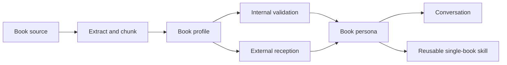

<div align="center">

[中文](./README.md) | English

# Bolan Skill


<sub>Cover inspired by huashu-design's humanist-minimalist direction: book pages, readers, textual anchors, external echoes, and agent reasoning constellations.</sub>

> "Turn a book from something summarized into someone who thinks with you."


**Bolan Skill (博览群书) is a reading skill for Claude Code, Codex, and other agents.**

It distills a book into a conversational persona you can keep talking to: ask what it says, then ask what it thinks about your life decisions, writing struggles, business judgment, value conflicts — and let it push back.

[Examples](#examples) · [Install](#install) · [Usage](#usage) · [What Bolan Distills](#what-bolan-distills) · [Dual-Loop Validation](#dual-loop-validation) · [Repository Structure](#repository-structure)

</div>

---

## Examples

These are not scripted replies — they show the feel of using Bolan.

```text
User      ❯ What does this book about long-term thinking actually say?

Bolan     ❯ It's not urging you to "persevere." It's unpacking something subtler:
            why humans mistake short-term noise for fate.

            What it truly cares about isn't the length of time, but whether
            you've handed your judgment over to an environment that rewards
            and punishes you instantly.

            If you take one line: don't rush to become stronger. First, stand
            somewhere that won't keep warping you.
```

Once distilled, you don't need to repeat the book title. Just talk to "the book."

```text
User      ❯ I keep wanting to start too many projects. What would this book think?

Book      ❯ I'd first ask: are these projects expanding your life, or
            scattering your anxiety?

            If a project exists only to prove "I'm not falling behind,"
            it's not a path — it's noise dressed as opportunity.

            You don't lack options. You lack an order that lets your
            choices be validated by time.

Bridge    ❯ This book wouldn't simply say "do less." It would ask you to
            distinguish: which things accumulate judgment, and which things
            only drain attention.

Question  ❯ If you could keep only one project that would make your
            three-years-from-now self freer, which would you keep?
```

When reader reception conflicts with the book's own claims, Bolan treats external opinion as calibration material — not the comment section as truth.

```text
User      ❯ A lot of people say this book is shallow motivation. How would
            the book respond?

Bolan     ❯ I can't erase reader dissatisfaction. External feedback shows a
            real risk: its expression is easily read as "just try harder."

            But from internal textual evidence, its core point isn't
            cheering you on — it's demanding that you bring environment,
            feedback, constraints, and time scale into your judgment.

            So the more accurate answer is: if you only read encouragement,
            it's indeed shallow. If you read the constraints, it starts
            becoming useful.
```

---

## Install

### Option 1: Let your agent install it

In Claude Code, Codex, Cursor, OpenClaw, Gemini CLI, or any runtime that supports Agent Skills, just say:

```text
Install this skill for me: https://github.com/BlackFast/bolan-skill
```

If your environment has the `skills` CLI:

```bash
npx skills add BlackFast/bolan-skill
```

### Option 2: Manual install

Clone the repo into your runtime's skills directory:

```bash
# Claude Code
git clone https://github.com/BlackFast/bolan-skill ~/.claude/skills/bolan-skill

# Codex
git clone https://github.com/BlackFast/bolan-skill ~/.codex/skills/bolan-skill

# Cursor
git clone https://github.com/BlackFast/bolan-skill ~/.cursor/skills/bolan-skill
```

For environments that don't auto-load skills, you can also paste [SKILL.md](./SKILL.md) directly into a conversation. It's essentially a Markdown instruction set with YAML frontmatter.

---

## Usage

Bolan works in two phases.

### Phase 1: Distill

```text
Distill this book: <Book Title>.
Distill this book: <Book Title>, /path/to/book.pdf
What does <Book Title> say?
What is <Book Title> about?
Read <Book Title> for me and surface its key claims and controversies.
Deconstruct <Book Title> — cross-reference Douban, Amazon, and professional reviews.
```

Supports PDF, EPUB, DOCX, TXT, Markdown, full-text folders, chapter excerpts, reading notes, highlights, and tables of contents.

For local files, preprocess with the extraction script:

```bash
python3 scripts/prepare_book.py /path/to/book.pdf --out ./book-workspace
```

### Phase 2: Talk

After distillation, just say:

```text
I want to talk to this book.
What would this book think?
How would this book see my problem?
How would this book answer this?
Standing inside this book's logic — what should I be looking at?
Where would this book push back against me?
What question would this book ask me?
Use this book's way of thinking to help me with this.
```

Default response structure:

```markdown
**Book Voice**
<answers in the book's first-person voice>

**Reader Bridge**
<translates, contextualizes, or flags boundaries in plain language>

**A Question Back**
<asks you something that deepens the conversation>
```

---

## What Bolan Distills

A regular summary answers "what's the content." Bolan tries to preserve how a book thinks.

| Layer | What Bolan extracts |
| --- | --- |
| What the book is asking | Central question, wound, curiosity, era context |
| How it advances | Chapter structure, argument path, narrative rhythm |
| What it believes | Core claims, value ordering, criteria for judgment |
| How it speaks | Tone, metaphors, conceptual vocabulary, expressive DNA |
| Where it's unstable | Internal tensions, blind spots, overreach, silences |
| How it's been received | Douban, Amazon, Goodreads, professional reviews, academic and industry discussion |
| How it thinks with you | Book persona, conversational contract, question style, refusal boundaries |

This is why Bolan never pretends the persona is the actual author. It says:

```text
As this book, I would answer you this way.
```

Not:

```text
I am the author.
```

---

## Dual-Loop Validation

Bolan draws on Nuwa Skill's verification ethos but adapts it into two loops for reading: internal validation against the text, external validation against how real readers received the book.

### Inner Loop: Textual Evidence

| Factor | What it checks |
| --- | --- |
| Coverage | Are all available chapters, TOC, and excerpts covered — not a small sample passed off as the whole book? |
| Anchor | Are core claims anchored to chapters, pages, paragraphs, or chunks? |
| Concept | Are concepts used the way the book uses them? |
| Tension | Are contradictions, blind spots, and criticisms preserved? |
| Boundary | Does the persona know what it cannot speak to? |
| Voice | Do responses carry the book's own temperament, not generic AI summary tone? |

### Outer Loop: Reader Reception

| Factor | What to observe |
| --- | --- |
| Reader platforms | Douban, Amazon, Goodreads, WeRead reader reviews |
| Professional reviews | Newspapers, magazines, literary criticism, expert reviews |
| Academic / industry discussion | Citations, syllabi, industry debate, expert controversy |
| Negative reception | One-star reviews, rebuttals, disputes, common complaints |
| Reader transformation | What readers say the book changed in them |
| Misreading patterns | Common misreadings, oversimplifications, social-media versions |

External reception isn't a substitute for the text — it's calibration material:

- Which parts genuinely moved readers
- Which criticisms must be taken seriously
- Which popular takes actually stray from the book itself
- Which questions suit this book, and which need to go beyond it

---

## Workflow



When distilling a book seriously, Bolan will generate or suggest generating:

- `book-profile.md` — full distillation profile
- `dialogue-seed.md` — persona card and opening questions
- `validation-report.md` — internal and external validation report
- Optional `SKILL.md` — turn the book into a reusable single-book companion skill

---

## Repository Structure

```text
bolan-skill/
├── SKILL.md
├── README.md
├── LICENSE
├── assets/
│   ├── bolan-cover.svg
│   └── bolan-cover-canvas.html
├── agents/
│   └── openai.yaml
├── references/
│   ├── book-profile-template.md
│   ├── shelf-soul-template.md
│   ├── evolution-log-template.md
│   ├── single-book-skill-template.md
│   └── validation-framework.md
└── scripts/
    └── prepare_book.py
```

---

## Boundaries

- Does not output long copyrighted passages or copy full book content for the user.
- Does not treat comment-section consensus as fact.
- Does not present the book persona as the actual author.
- When working from fragments, must label output as a partial persona.
- For high-stakes topics (medical, legal, financial, mental health), provides frameworks and questions only — never a substitute for professional judgment.

---

## License

MIT License. See [LICENSE](./LICENSE).
